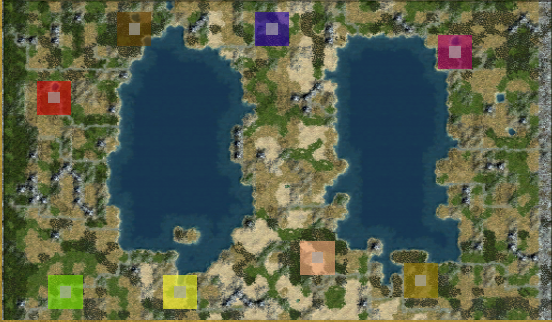

# Inland_Bridge.py
A Civilization IV mapscript based on Inland_Sea.py.
Features a center bridge splitting the sea into two, as well as several multiplayer-friendly customizations.



# Features
## Map Options
- Map Aspect Ratio: 16:10 or 4:3.
- Latitude: Both hemispheres or one hemisphere.
- Axial Tilt: 0, 90, and 45 degrees. 90 degrees is recommended for two-team games.
- Team Start: If enabled, groups teams into halves or corners of the map. No effect if more than 5 teams.
- Semi-Strategic Resource Balancing: If enabled, balances Ivory, Marble, and Stone resources by team playercount. (Note: the game engine might add these bonuses near starts anyway)

## Map Dimensions
Here are the two tables updated with `NumPlayers` converted to `NvN` format:

**16:10 Ratio Option**
| Mapsize   | W   | H   | Area | NumPlayers | Area/Player |
|-----------|-----|-----|------|------------|-------------|
| duel      | 24  | 16  | 384  | 1v1        | 192         |
| tiny      | 32  | 20  | 640  | 2v2        | 160         |
| small     | 40  | 24  | 960  | 3v3        | 160         |
| Standard  | 48  | 28  | 1344 | 4v4        | 168         |
| large     | 52  | 32  | 1664 | 5v5        | 166       |
| huge      | 60  | 36  | 2160 | 6v6        | 180         |

**4:3 Ratio Option**
| Mapsize   | W   | H   | Area | NumPlayers | Area/Player   |
|-----------|-----|-----|------|------------|---------------|
| duel      | 24  | 16  | 384  | 1v1        | 192           |
| tiny      | 32  | 24  | 768  | 2v2        | 192           |
| small     | 36  | 28  | 1008 | 3v3        | 168           |
| Standard  | 40  | 32  | 1280 | 4v4        | 160           |
| large     | 44  | 36  | 1584 | 5v5        | 158         |
| huge      | 52  | 40  | 2080 | 6v6        | 173   |


# Instructions
1. Download Inland_Bridge.py from the latest [release.](https://github.com/AineiasStymphalios/Inland_Bridge.py/releases)

2. Add Inland_Bridge.py to:
- CD version:
```
C:\Program Files\Firaxis Games\Civilization 4\Beyond the Sword\PublicMaps
```

- Steam version:
```
C:\Program Files (x86)\Steam\steamapps\common\Sid Meier's Civilization IV Beyond the Sword\Beyond the Sword\PublicMaps
```
3. Load Civ4. Select Central_Plains through *PLAY NOW* or *CUSTOM GAME.*


## Version support
This mapscript supports Civ4 Beyond the Sword, Warlords, and Vanilla.

## Mod support
This mapscript should work with most vanilla-like mods (e.g. BUG, BUFFY, AdvCiv ...).
